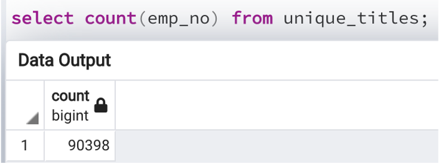
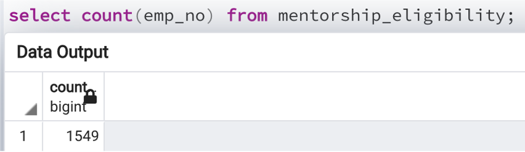
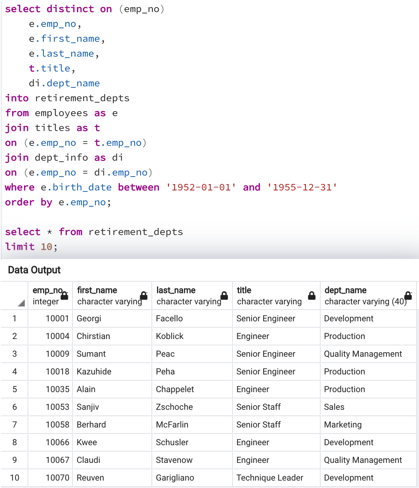
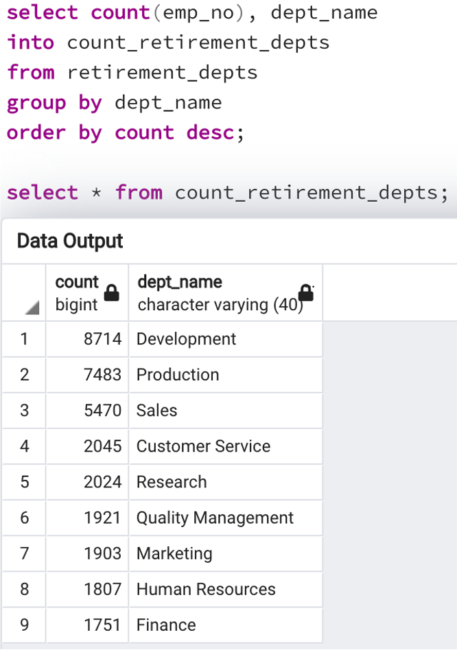
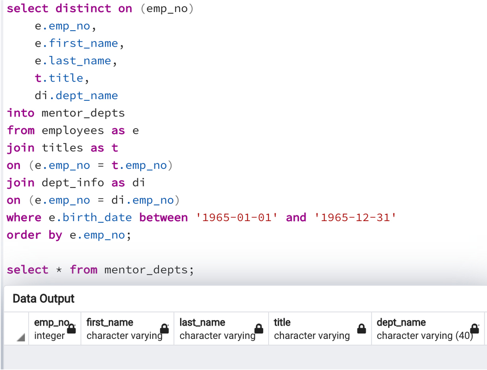

# Pewlett Hackard Analysis
## Challenge Week 7: SQL
### Overview
#### Purpose
The purpose of this analysis is to parse through the very large list of Pewlett Hackard employees to determine:
- how many are still employed
- the birth dates of the employees so that we can determine who is nearing retirement age
- the departments that will have retiring employees

#### Data
The data that we used was stored within 6 .csvs. We used SQL to create tables, import from the .csvs, and view the data. We then produced new tables to determine:
- who the retiring individuals will likely be (based on their birth dates)
- a count of the retiring individuals grouped by job title
- the employees who may be interested in mentoring the next generation of employees

### Results
#### Analysis Deliverables
The first analysis deliverable is to produce a table with the names of all employees who will be retiring in the near future. The second analysis deliverable is to produce a table with the names of all employees who may be eligible to mentor new employees who will be replacing those retiring. We completed this analysis in the following 4 steps:
1. finding all employees whose birthdates are between 1952 and 1955
2. eliminating all duplicate employee names (as some have moved from one department to another over time)
3. counting the number of employees retiring
4. finding all employees whose birthdates are in 1965

#### Silver Tsunami
There are 90,398 retiring employees, as you can see with the query below:

There are 1,549 mentorship-eligible employees, as you can see with the query below:

As you can see, there are 90,398 positions to fill, and only 1,549 possible employees to mentor the new employees. There is an insufficient amount of employees to fill the mentorship roles.

### Additional Conclusions
#### Data Issues: Missing Departments for Retirees and Mentors
##### Retirees
To further analyse the data, it was necessary to understand the departments that the retiring individuals would be leaving. The following query helped to add the department names to the retiring individuals:

Unfortunately, when you group by department to count the employees, it becomes clear that not all employees retiring are associated with a department, as you can see below:

With 57,200 retiring individuals who do not have departments listed, Pewlett Hackard will have a much more difficult time replacing them.
##### Mentors
When analysing the departments that the individuals who are mentorship-eligible come from, it is clear that none of these individuals have a dept_no attached to their employee records, as you can see below:

